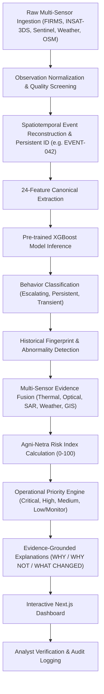

# Agni-Netra: Spaceborne Thermal Event Intelligence

> **SIH Problem Statement:** PS162  
> **Tagline:** *"The satellite sees heat. Agni-Netra understands the event."*

Agni-Netra is a production-style geospatial artificial intelligence platform that ingests raw multi-satellite thermal detections across India and transforms them into actionable, evidence-fused operational intelligence.

---

## Visual Interface & Information Architecture

Agni-Netra adheres to a clean, sober, high-density engineering dashboard designed for mission-critical industrial monitoring, defense, and disaster response analysts:

- **Unified System Overview**: Real-time KPI metrics tracking active thermal events, high-priority escalations, events under human verification, and 24-hour resolutions.
- **Interactive Geospatial Map (MapLibre GL JS)**: Interactive vector/satellite visualization of events across India with priority-coded indicators, cluster handling, and quick inspection cards.
- **Explainable AI Drilldown**: Full evidence ledger and natural language explanations answering **WHY**, **WHY NOT**, and **WHAT CHANGED**.
- **Human-in-the-Loop Verification**: Analyst confirmation, dispute, and audit trail preserving distinct AI hypotheses and human decisions.

---

## Logical Pipeline



---

## Core Semantic Distinctions

Agni-Netra strictly maintains semantic separation across analytical entities:

| Concept | Meaning | Example |
| :--- | :--- | :--- |
| **Observation** | Single raw satellite pixel detection | VIIRS pass at 14:20 IST, FRP 286.4 MW |
| **Event** | Clustered physical phenomenon tracked over time | `EVENT-042` |
| **Source Class** | Underlying physical heat generator | `Industrial Fire`, `Routine Flare`, `Agricultural Burn` |
| **Behavior** | Dynamic pattern of thermal evolution | `Escalating rapid increase`, `Persistent + Stable` |
| **Abnormality** | Statistical divergence from historical facility envelope | `Highly Abnormal`, `Normal` |
| **Risk Index** | Decision-support score based on hazard, footprint & assets | `82 / 100` |
| **Priority** | Queue urgency for operational analyst inspection | `Critical`, `High`, `Medium`, `Low` |
| **Verification** | Separate human analyst evaluation state | `Needs Verification`, `Confirmed`, `Rejected` |

---

## Technology Stack

- **Backend**: Python 3.10+, FastAPI, SQLAlchemy, Pydantic v2
- **Database**: SQLite (Production-ready abstraction with zero external daemon requirements)
- **Frontend**: Next.js 14, React 18, TypeScript, Tailwind CSS
- **Maps**: MapLibre GL JS
- **Icons**: Lucide React
- **Geospatial & ML**: XGBoost (pre-trained artifacts in `models/b0`), scikit-learn, Shapely, NumPy, Pandas

*Strictly no Docker, no Redis, and no PostgreSQL required for local execution.*

---

## Quick Start & Local Setup

### 1. Prerequisites
Ensure you have **Python 3.10+** and **Node.js 18+** installed.

### 2. Backend Setup
```bash
# Clone the repository
git clone https://github.com/Team-Believer/Agni-Netra.git
cd Agni-Netra

# (Optional) Create and activate virtual environment
python -m venv .venv
# On Windows:
.venv\Scripts\activate
# On Linux/macOS:
# source .venv/bin/activate

# Install dependencies
pip install -r requirements.txt

# Seed realistic demonstration database
python backend/app/seed.py

# Start FastAPI backend
uvicorn backend.app.main:app --reload --port 8000
```
*Backend will be live at `http://localhost:8000` (Interactive API docs at `http://localhost:8000/docs`). Note: Agni-Netra now supports `data_mode` (LIVE/SEED) to cleanly separate real production data from demonstration artifacts.*

### 3. Frontend Setup
In a new terminal window:
```bash
cd frontend

# Install dependencies
npm install

# Start Next.js development server
npm run dev
```
*Open `http://localhost:3000` in your browser to view the Agni-Netra dashboard.*

---

## Demonstration Scenarios

Agni-Netra includes seeded deterministic real-world operational scenarios:

### Scenario 1: EVENT-SEED-002 — Abnormal Industrial Fire Escalation
- **Location**: Korba Super Thermal Power, Chhattisgarh (22.39° N, 82.68° E)
- **Observed Behavior**: FRP surged +140%; footprint expanded 2.1x outward.
- **AI Classification**: `Industrial Fire (Hypothesis)` with 89% confidence.
- **Risk Index**: `88.0 / 100` (Critical Priority).
- **Explanation**: Footprint growth discounts normal flare stack emission.
- **Data Mode**: SEED

### Scenario 2: EVENT-SEED-001 — Routine Facility Flare
- **Location**: Bhilai Steel Plant, Chhattisgarh
- **Observed Behavior**: Stationary point source, stable FRP.
- **AI Classification**: `Routine Flare` (Low Priority, Monitoring).
- **Data Mode**: SEED

### Scenario 3: EVENT-SEED-003 — Forest Fire
- **Location**: Barnawapara Reserve, Chhattisgarh
- **Observed Behavior**: Vegetation fire spreading north.
- **AI Classification**: `Forest Fire` (Medium Priority).
- **Data Mode**: SEED

---

## Running the Data Pipeline Manually

To ingest live observations or run a new reconstruction and inference cycle:
```bash
python scripts/run_pipeline.py
```

---

## Running Automated Tests

```bash
# Run backend API and verification suite
python -m pytest tests/test_backend_api.py -v

# Run AI model unit verification
python -m pytest src/model/test_b0.py -v
```

---

## REST API Overview

| Endpoint | Method | Description |
| :--- | :--- | :--- |
| `/api/health` | GET | Health check and system operational state |
| `/api/dashboard/summary` | GET | KPI metrics (active, high priority, under verification, resolved) |
| `/api/dashboard/hotspots` | GET | GeoJSON feature collection for MapLibre layer |
| `/api/dashboard/alerts` | GET | Active priority alerts |
| `/api/events` | GET | List events with filtering (status, priority, search) |
| `/api/events/{id}` | GET | Complete event detail, explanations, and evidence ledger |
| `/api/events/{id}/timeline` | GET | Chronological sensor observation timeline |
| `/api/events/{id}/verify` | POST | Submit analyst human verification decision |
| `/api/sources` | GET | Ingestion sensor adapters status and latency |
| `/api/reports/{id}` | GET | Export structured event report |
| `/api/reports/export/csv` | GET | Bulk export events as CSV |
| `/api/models/status` | GET | Status of pre-trained XGBoost model |

---

## Future Roadmap

- **PostGIS & TimescaleDB Migration**: The repository layer is cleanly decoupled so SQLite can be swapped for PostgreSQL + PostGIS in cloud production.
- **Direct INSAT-3DS NetCDF Stream**: Direct real-time ingestion from ISRO IMDPS push streams.
- **Automated Tasking Request**: Automatic tasking request dispatch to high-resolution optical satellites upon P0 priority escalation.

---

## License & Team
Developed by **Team Believer** for Smart India Hackathon (SIH) Problem Statement PS162.
