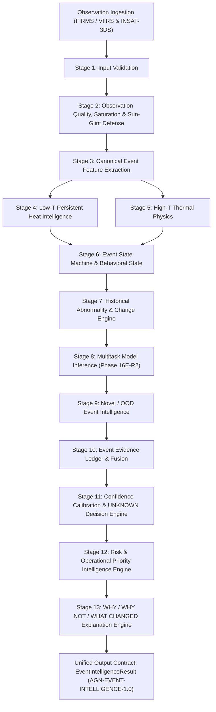

# Agni-Netra: AI/ML Thermal Event Intelligence Stack

**Agni-Netra** is a production AI/ML intelligence engine for satellite-based thermal event detection, source classification, behavioral state tracking, out-of-distribution (OOD) novelty detection, evidence aggregation, risk prioritization, and evidence-grounded explanations.

---

## Key Features & Capabilities

- **Single Entry Point (`analyze_event()`)**: Unified 13-stage orchestration pipeline.
- **Frozen Output Contract (`AGN-EVENT-INTELLIGENCE-1.0`)**: 16-section versioned output contract with built-in schema validator (`validate_event_intelligence_result`).
- **Observation Quality & Glint/Saturation Defense**: Detects daytime solar glint and thermal saturation / pixel-folding risk (Phase 20A).
- **Multi-Lane Thermal Intelligence**: Low-T persistent heat lane (Phase 17B) & High-T thermal physics lane (Phase 20C).
- **Event Behavioral State Machine**: Tracks physical process evolution across 10 deterministic states (Phase 20D).
- **Novel / OOD Event Intelligence**: Detects unrepresented thermal phenomena, preventing forced classification and handling model-confidence paradoxes (Phase 20E).
- **Evidence Aggregation Ledger**: Aggregates multi-source evidence items with sensor provenance, completeness, and convergence tracking (Phase 17D).
- **Calibrated Confidence & Safe Abstention**: Gated decision states (`KNOWN`, `UNKNOWN`, `NEEDS_VERIFICATION`, `INSUFFICIENT_OBSERVATION`) with temperature-scaled calibration (Phase 17E).
- **Risk & Operational Priority Engine**: Evaluates physical hazard, contextual facility impact, base risk, operational urgency, and priority levels `P0` to `P4` (Phase 17F).
- **Structured Explanation Engine**: Evidence-grounded `summary`, `why`, `why_not`, `what_changed`, `uncertainty`, and `next_action` explanations (Phase 17G).
- **Real-Data Replay & Demonstration Suite**: Replays real FIRMS/VIIRS events deterministically (`src/intelligence/real_event_replay.py`, `src/intelligence/demo_scenarios.py`).

---

## Frozen AI/ML Architecture Pipeline



---

## Quick Start & Usage

### 1. Run Event Analysis
```python
from src.intelligence.analyze_event import analyze_event

raw_event = {
    "event_id": "AGN-E-000421",
    "lat": 26.5714,
    "lon": 101.6703,
    "observation_count_so_far": 5,
    "current_max_frp": 30.66,
    "current_duration": 48.0,
    "proxy_industrial_context": 1.2
}

# Execute 13-stage intelligence pipeline
result = analyze_event(raw_event)
print("Predicted Class:", result.source_assessment["predicted_source_class"])
print("Decision State:", result.source_assessment["decision_state"])
print("Priority Level:", result.priority_assessment["priority_level"])
```

### 2. Output Contract Validation
```python
from src.intelligence.output_contract import validate_event_intelligence_result, build_canonical_contract

contract = build_canonical_contract(result.to_dict())
errors = validate_event_intelligence_result(contract)
assert len(errors) == 0, "Schema validation failed"
```

### 3. Run Test Suite
```bash
python -m pytest tests/
```

---

## Documentation Index

- [Project File & Path Map](docs/project_path_map.md)
- [AI/ML Final Architecture Master Document](docs/ai_ml_final_architecture.md)
- [AI Output Schema Contract Specification](docs/ai_output_contract.md)
- [Real-Data AI Readiness Report](docs/real_data_ai_readiness.md)
- [AI Behavioral Demonstration Scenarios](docs/ai_behavior_demo_scenarios.md)
- [Sample Handoff Output Payload (JSON)](docs/examples/event_intelligence_example.json)

---

## Operational Disclaimer

> [!IMPORTANT]
> - `REAL OBSERVATION != REAL GROUND TRUTH`: Spaceborne satellite thermal detections represent real observations (`REAL_OBSERVATION`). A multi-facility ground truth gold standard (`REAL_GOLD`) is not established.
> - `UNKNOWN IS A VALID OUTCOME`: Safe abstention (`UNKNOWN` / `NEEDS_VERIFICATION` / `INSUFFICIENT_OBSERVATION`) is triggered when data is sparse, saturated, or contradictory.
