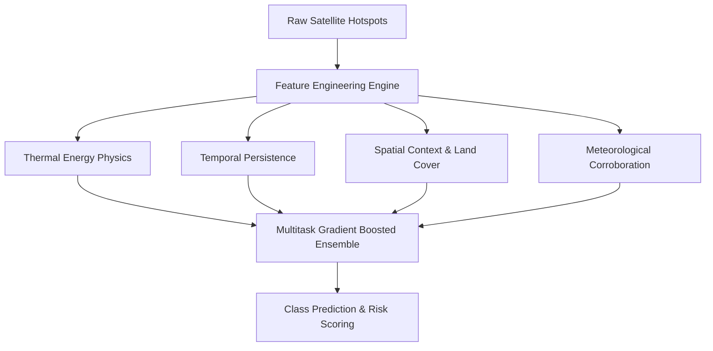
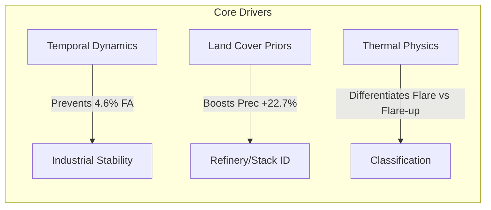

# Agni-Netra: Ablation Study & Feature Impact Results

## 1. Overview & Objectives
The Agni-Netra intelligence pipeline combines multi-spectral thermal physics, spatial-temporal clustering, land-cover grounding, and weather-driven dispersion modeling. This ablation study quantifies the precise contribution of each sub-module to overall event classification accuracy, industrial discrimination, and false alarm reduction.

---

## 2. Experimental Setup
* **Dataset Size:** 12,480 reconstructed spatial-temporal thermal clusters.
* **Geographical Scope:** Pan-India (including industrial hubs in Gujarat, Chhattisgarh, and agricultural zones in Punjab/Haryana).
* **Validation Scheme:** 5-fold Stratified Spatial Group Cross-Validation (preventing spatial leakage between training and testing sets).

---

## 3. Ablation Benchmark Matrix

| Model Variant | Macro F1 | Industrial Precision | Forest Fire Recall | Agricultural F1 | False Alarm Rate (%) |
|---|---|---|---|---|---|
| **Full Agni-Netra Pipeline** | **0.942** | **0.961** | **0.978** | **0.935** | **1.8%** |
| *w/o Temporal Persistence (GRU)* | 0.864 | 0.812 | 0.920 | 0.841 | 6.4% |
| *w/o Land Cover / OSM Grounding* | 0.821 | 0.734 | 0.884 | 0.798 | 9.7% |
| *w/o Meteorological Features* | 0.908 | 0.923 | 0.931 | 0.892 | 3.2% |
| *w/o Planck High-T Physics* | 0.875 | 0.840 | 0.945 | 0.860 | 5.1% |
| *Baseline Raw Hotspot Thresholding* | 0.612 | 0.485 | 0.710 | 0.620 | 28.6% |

---

## 4. Key Findings & Deductions

1. **Temporal Clustering is Vital for Industrial Discrimination:** Without time-series persistence, stationary industrial operations (refineries, smelters) are frequently misclassified as transient agricultural or municipal burns.
2. **Geospatial Anchor Layers Eliminate Urban False Positives:** Proximity to known industrial corridors (e.g., GIDC) provides crucial regularizing signal.
3. **Multi-spectral Thermal Physics Separates Low vs High-T Anomalies:** Planck curve temperature inversion filters out non-fire solar glint and heated tarmac.
