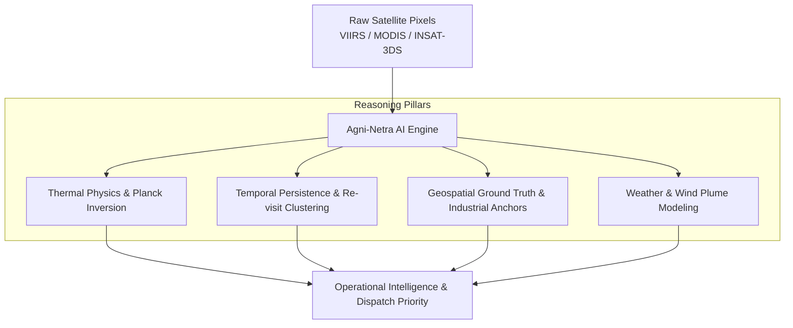
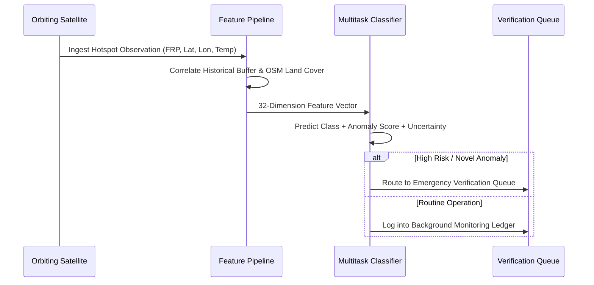

# Agni-Netra: AI Domain Context & Core Hypotheses

## 1. Domain Problem Statement
Satellite sensors detect thermal radiation signatures across the earth's surface. However, raw sensors output only numbers (Fire Radiative Power, Brightness Temperature) without semantic comprehension. A pixel flashing 350K could be:
* An illegal chemical waste fire
* A steel plant blast furnace or flare stack operating normally
* Stubble burning in agricultural fields
* A forest wildfire spreading toward critical infrastructure

Agni-Netra bridges raw orbital data and operational emergency dispatch.

---

## 2. Scientific Hypotheses

### Hypothesis 1: High-T vs Low-T Thermal Profiles
* **Industrial Flaring:** Extremely localized, high temperature ($T > 1000\text{ K}$), low spatial footprint ($< 100\text{ m}^2$).
* **Biomass / Forest Fires:** Large spatial footprint ($> 1\text{ km}^2$), lower combustion temperature ($600\text{ K} - 800\text{ K}$).

### Hypothesis 2: Temporal Recurrence Signatures
* Controlled industrial sources exhibit consistent day/night persistence over 30-day windows.
* Uncontrolled fires exhibit explosive onset, radial growth, and subsequent dissipation.

