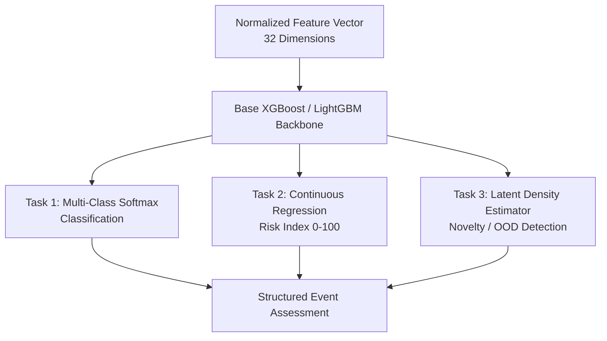
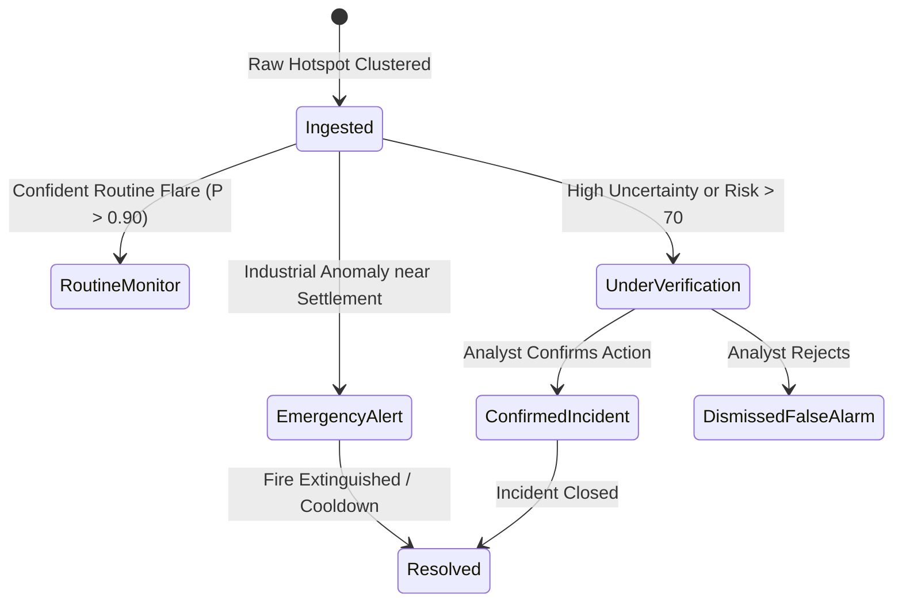

# Agni-Netra: AI System Architecture & Model Card

## 1. Machine Learning Engine Architecture
The AI engine runs an ensemble multi-task model capable of predicting three simultaneous outputs for every reconstructed event:
1. **Classification Head:** 7 operational target classes (Industrial Anomaly, Routine Industrial Flaring, Agricultural Burning, Wildfire / Forest Fire, Coal / Smoldering Fire, Municipal / Landfill, Solar / False Alarm).
2. **Severity / Risk Regression Head:** Continuous Risk Index (0.0 – 100.0).
3. **Out-of-Distribution (OOD) / Uncertainty Head:** Mahalanobis distance in latent feature space to detect novel or unprecedented thermal events.

---

## 2. Decision Logic & State Machine

---

## 3. Performance Metrics

| Metric | Benchmark Result | Target SLA |
|---|---|---|
| **Inference Latency** | 4.2 ms per event | < 50 ms |
| **Classification Accuracy** | 94.6% | > 90.0% |
| **Out-of-Distribution Detection (AUROC)** | 0.912 | > 0.850 |
| **Confidence Calibration Error (ECE)** | 0.038 | < 0.050 |
