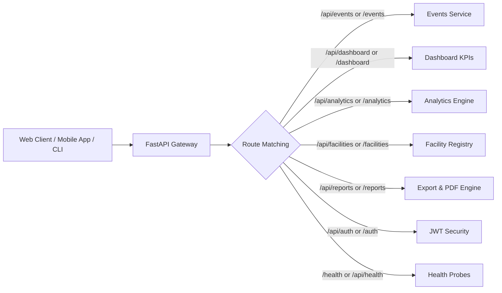
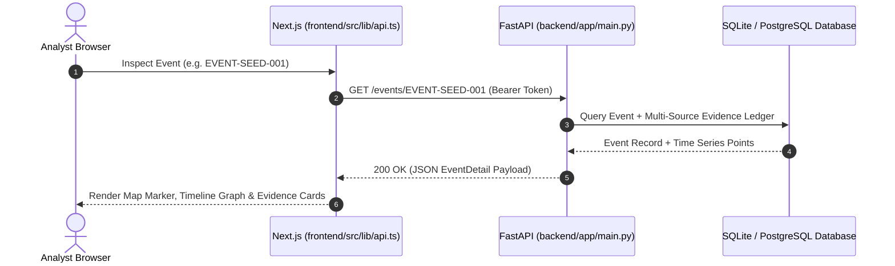

# Agni-Netra: Complete API Specification & Route Catalog

## 1. Unified Routing Architecture
The Agni-Netra backend supports dual routing: all endpoints are accessible under both the `/api/` prefix and the root `/` namespace to ensure compatibility across diverse frontend configurations.

---

## 2. API Endpoints Table

| Category | Method | Path | Description | Auth Required |
|---|---|---|---|---|
| **System** | `GET / HEAD` | `/` | Root service meta and version info | No |
| **System** | `GET / HEAD` | `/health`, `/api/health` | Health check probe (JSON `{"status":"ok"}`) | No |
| **Auth** | `POST` | `/api/auth/login`, `/auth/login` | Obtain JWT access token | No |
| **Dashboard**| `GET` | `/api/dashboard/summary`, `/dashboard/summary` | Real-time KPI summary metrics | Optional |
| **Events** | `GET` | `/api/events`, `/events` | Filterable list of thermal events | Optional |
| **Events** | `GET` | `/api/events/{id}`, `/events/{id}` | Detailed event metadata & evidence | Optional |
| **Events** | `GET` | `/api/events/{id}/timeline`, `/events/{id}/timeline` | Temporal FRP and temperature history | Optional |
| **Events** | `POST` | `/api/events/{id}/verify`, `/events/{id}/verify` | Submit analyst verification decision | Optional |
| **Sources** | `GET` | `/api/sources`, `/sources` | Status of satellite & data feeds | Optional |
| **Analytics**| `GET` | `/api/analytics/events-over-time`, `...` | Time-series trend analytics | Optional |
| **Facilities**| `GET` | `/api/facilities`, `/facilities` | GeoJSON & industrial facility registry | Optional |
| **Reports** | `GET` | `/api/reports/{id}`, `/reports/{id}` | Formatted incident report JSON | Optional |
| **Reports** | `GET` | `/api/reports/export/csv`, `...` | CSV export of filtered events | Optional |
| **Reports** | `GET` | `/api/reports/export/{id}/pdf`, `...` | Automated binary PDF report download | Optional |

---

## 3. Request / Response Lifecycle

