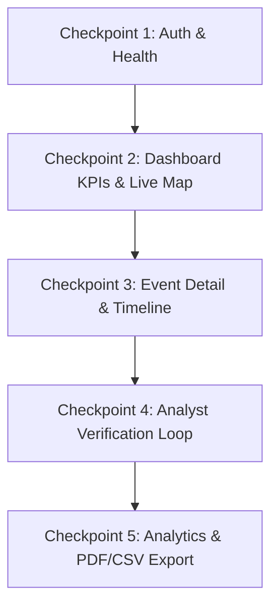

# Agni-Netra: Combined API Checkpoints & Verification Guide

## 1. Overview
This document outlines the test checkpoints used to validate the end-to-end integration between the FastAPI backend and Next.js frontend across all operational phases.



---

## 2. Checkpoint Test Suite

### Checkpoint 1: Health & Connectivity Probes
* **Objective:** Ensure render health checks and root endpoints respond with 200 OK.
* **Commands:**
  ```bash
  curl -i http://localhost:8000/health
  curl -i -X HEAD http://localhost:8000/
  ```
* **Expected Result:** HTTP 200 OK, `{"status":"ok"}`.

### Checkpoint 2: Dashboard & Event Filtering
* **Objective:** Verify dynamic querying across status, priority, and date range.
* **Request:** `GET /events?status=Needs%20Verification&priority=High`
* **Assertion:** Array of matching event records with valid geographical coordinates.

### Checkpoint 3: Interactive Event Verification
* **Objective:** Ensure an analyst can submit confirmation or dismissal with audit trail.
* **Request:**
  ```http
  POST /events/EVENT-SEED-002/verify
  Content-Type: application/json

  {
    "decision": "confirmed",
    "comment": "Confirmed high-temperature flare-up via INSAT-3DS stream",
    "reviewer": "Ananya Sharma"
  }
  ```
* **Assertion:** Status updates to `Confirmed Incident`, event reflected in verification log.
