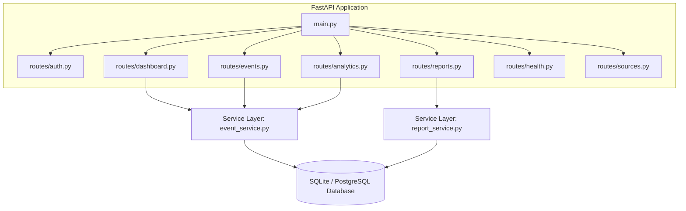

# Agni-Netra: Backend API Architecture

## 1. Backend Service Design
The backend is built with **FastAPI**, **SQLAlchemy ORM**, **Pydantic v2**, and **Uvicorn**. It implements asynchronous request handling with clean modular routers located under `backend/app/api/routes/`.

---

## 2. Key Modules & Responsibilities

| Module Path | Primary Responsibility |
|---|---|
| `backend/app/main.py` | Application initialization, CORS middleware, dual routing registration, health probes |
| `backend/app/core/config.py` | Pydantic BaseSettings for database URLs, JWT keys, and model paths |
| `backend/app/database/models.py` | SQLAlchemy ORM models (`Event`, `Observation`, `Verification`, `Facility`, `Alert`) |
| `backend/app/services/event_service.py` | Business logic for spatial clustering, KPI generation, timeline extraction |
| `backend/app/services/verification_service.py` | Analyst review management and event state transitions |
| `backend/app/services/report_service.py` | PDF synthesis (ReportLab) and CSV stream generation |

---

## 3. Error Handling & Security Model
* **CORS:** Configured to allow Next.js development and production domains with support for credentials.
* **Authentication:** OAuth2 Password Bearer flow with HS256 JWT tokens.
* **Fallback Mode:** Development mode automatically provisions a default mock analyst identity (`Dax`) when token is omitted in dev environments.
