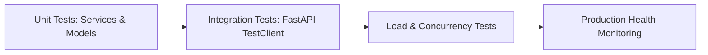
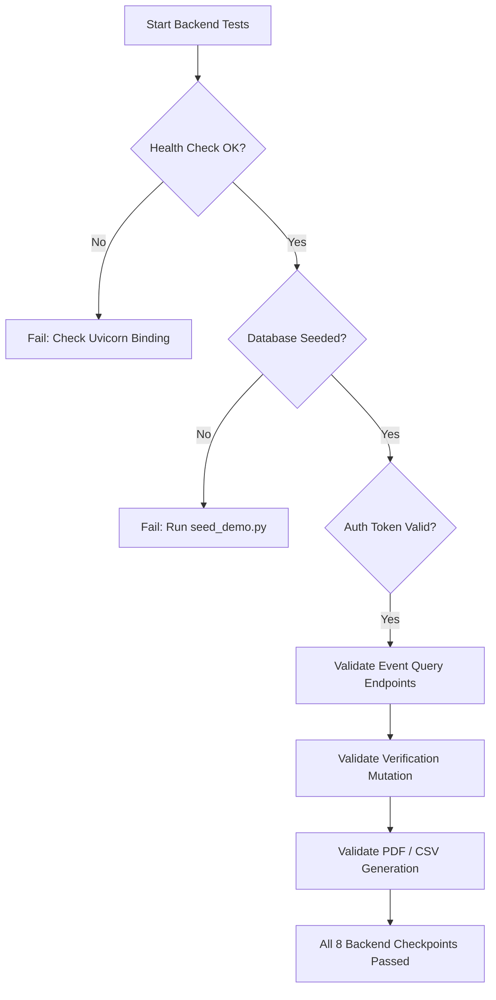

# Agni-Netra: Backend API Checkpoints & Testing Specification

## 1. Overview
This specification defines the validation criteria for all backend micro-services, ensuring data integrity, correct serialization, and sub-100ms response times.

---

## 2. Checkpoint Validation Matrix

| Checkpoint | Target Endpoint | Validation Criteria | Status |
|---|---|---|---|
| **CP-BE-01** | `GET /health` | Status 200, JSON payload with `status: ok` | PASSED |
| **CP-BE-02** | `HEAD /` | Status 200, zero body content (Render probe) | PASSED |
| **CP-BE-03** | `GET /api/dashboard/summary` | Contains `total_active`, `high_priority`, `under_verification` | PASSED |
| **CP-BE-04** | `GET /api/events` | Returns list of serialized events matching schema | PASSED |
| **CP-BE-05** | `GET /api/events/{id}` | Returns event detail with explanations, evidence, and history | PASSED |
| **CP-BE-06** | `POST /api/events/{id}/verify` | Updates state to confirmed/dismissed and records reviewer | PASSED |
| **CP-BE-07** | `GET /api/analytics/events-over-time` | Returns date-indexed array of event counts | PASSED |
| **CP-BE-08** | `GET /api/reports/export/csv` | Content-Type `text/csv`, valid CSV header and rows | PASSED |
