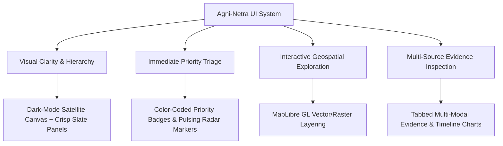
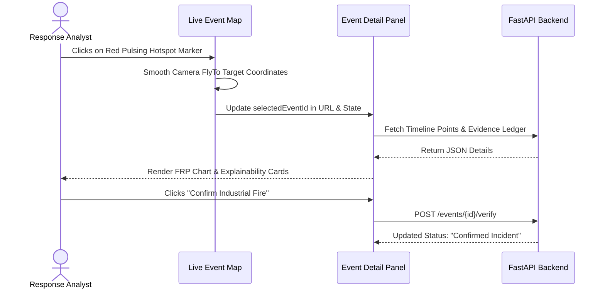
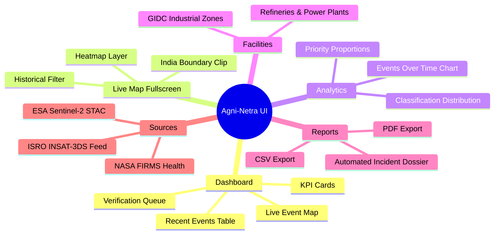

# Agni-Netra: UI/UX Design System & Interface Architecture

## 1. Design Vision & Principles
The Agni-Netra interface is crafted specifically for **Mission-Critical Geospatial Operations & Disaster Response Analysts**. The visual language combines high-density operational telemetry with clean modern aesthetics (glassmorphism, subtle micro-animations, tailored contrast, and clear priority visual cues).



---

## 2. Global Layout & Page Architecture

```mermaid
graph TB
    subgraph Global Shell
        HEADER[Global Header: Live Status, Search Bar, Quick Refresh, User Avatar]
        SIDEBAR[Collapsible Sidebar Navigation: Dashboard, Live Map, Events, Analytics, Facilities, Reports, Sources, Settings]
    end

    subgraph Dashboard View /dashboard
        KPIS[KPI Cards: Active Thermal Events, High Priority, Under Verification, 24h Resolved]
        MAP[Live Event Map: Satellite Basemap + City/Borders Overlay + Interactive Markers]
        TABLE[Recent Events Table: Real-time Paginated Filterable Data Grid]
        QUEUE[Under-Verification Queue: Analyst Action Cards]
        PANEL[Selected Event Detail Panel: Overview, Evidence, Timeline, Media, Actions]
    end

    HEADER --> Dashboard View
    SIDEBAR --> Dashboard View
    MAP <--> PANEL
    TABLE <--> PANEL
    QUEUE <--> PANEL
```

---

## 3. Design System & Color Tokens

### Priority & Severity Matrix
| Priority Level | Hex Color | Background Token | Ring / Pulse Effect | Usage |
|---|---|---|---|---|
| **Critical** | `#DC2626` / `#EF4444` | `bg-red-50 text-red-600` | `ring-red-300 animate-ping` | Major chemical fires, forest fires threatening cities |
| **High** | `#EA580C` / `#F97316` | `bg-orange-50 text-orange-600` | `ring-orange-300` | Uncontrolled industrial spikes, rapid expansion |
| **Medium** | `#EAB308` | `bg-amber-50 text-amber-700` | `ring-amber-200` | Agricultural burns, moderate thermal anomalies |
| **Low / Monitor**| `#16A34A` / `#3B82F6` | `bg-emerald-50 text-emerald-600`| `ring-emerald-200` | Controlled flaring, standard industrial operations |
| **Verification** | `#2563EB` | `bg-blue-50 text-blue-600` | `ring-blue-300` | Anomalies pending human-in-the-loop signoff |

---

## 4. Key UI Components & Interactions

### I. Live Event Map ([`LiveEventMap.tsx`](file:///d:/Buildlaunchs/Agni-Netra/frontend/src/components/LiveEventMap.tsx))
* **Satellite Base:** Esri World Imagery providing true color optical context.
* **Geographical Overlay:** Esri World Boundaries and Places reference layer delivering crisp state/district boundaries and place names without watermarks.
* **Interactive Hotspot Markers:** Animated pulsing SVG markers colored by threat severity with hover zoom and click-to-focus flight animations (`flyTo`).
* **Selected Event Card:** Glassmorphism overlay card showing event ID, title, lat/lon coordinates, observation counts, and a direct link to the full-screen live map.

### II. Event Detail Drawer ([`EventDetailPanel.tsx`](file:///d:/Buildlaunchs/Agni-Netra/frontend/src/components/EventDetailPanel.tsx))
* **Overview Tab:** Quick metrics (FRP, Brightness Temp, Footprint Area, Confidence Score).
* **Evidence Tab:** Multi-source corroborate ledger (Supporting vs Conflicting observations).
* **Timeline Tab:** High-resolution Recharts time-series graph showing FRP spikes over time.
* **Actions Tab:** One-click analyst decisions (*Confirm Incident*, *Dismiss as False Alarm*, *Request Satellite Re-visit*).



---

## 5. Screen Portfolio & Navigation


