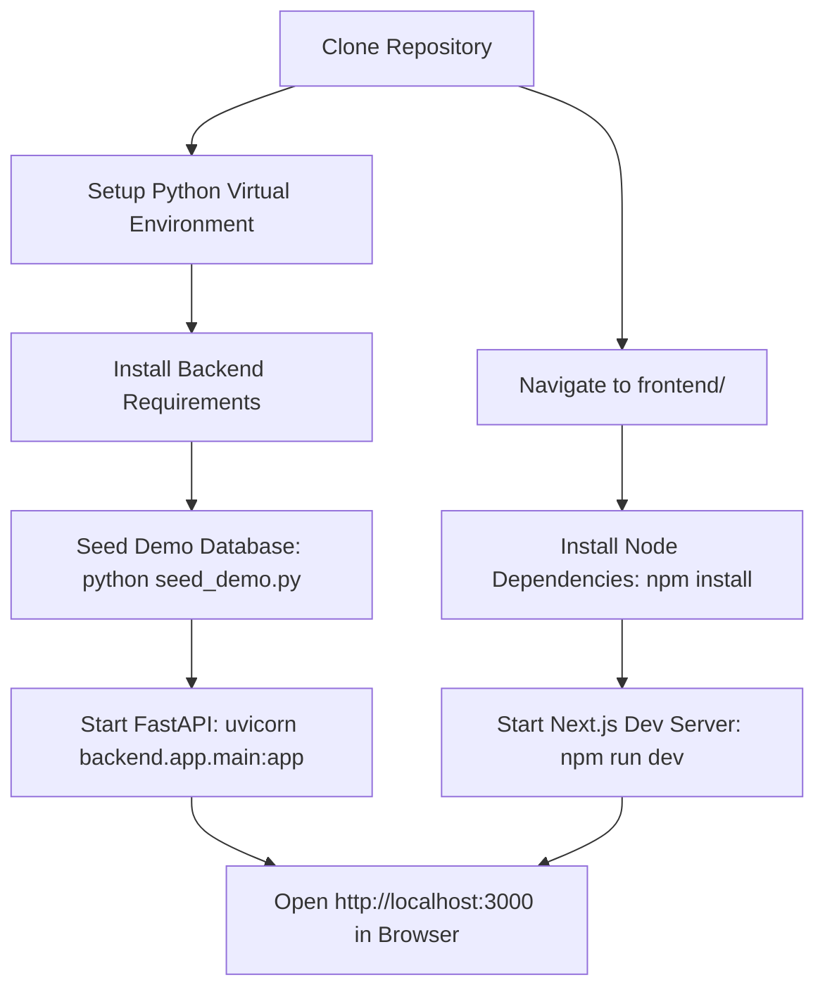

# Agni-Netra: Developer Onboarding & Contribution Guide

## 1. Quick Start Workflow



---

## 2. Environment Setup

### Backend Setup
```bash
# 1. Create and activate virtual environment
python -m venv .venv
source .venv/bin/activate  # On Windows: .venv\Scripts\activate

# 2. Install dependencies
pip install -r requirements.txt

# 3. Seed demo database with realistic spaceborne events
python seed_demo.py

# 4. Run local FastAPI server
uvicorn backend.app.main:app --reload --port 8000
```

### Frontend Setup
```bash
# 1. Navigate to frontend directory
cd frontend

# 2. Install dependencies
npm install

# 3. Create .env.local file
echo "NEXT_PUBLIC_API_URL=http://localhost:8000" > .env.local

# 4. Start Next.js development server
npm run dev
```

---

## 3. Repository Structure & Coding Conventions

```
Agni-Netra/
├── backend/            # FastAPI REST backend & Database schemas
│   └── app/
│       ├── api/routes/ # Individual modular router endpoints
│       ├── core/       # Configurations and logging
│       ├── database/   # SQLAlchemy models and SQLite connection
│       └── services/   # Business logic (event, alert, report, verification)
├── frontend/           # Next.js 14 App Router client
│   └── src/
│       ├── app/        # Dashboard, Live Map, Reports, Analytics, Settings
│       ├── components/ # Reusable UI widgets & MapLibre map component
│       └── lib/        # API client and TypeScript definitions
├── data/               # Spatial reference datasets and demo SQLite database
├── docs/               # System architecture and technical documentation
├── models/             # Machine learning model artifacts and weights
└── tests/              # Unit, integration, and end-to-end tests
```

---

## 4. Running Tests & Quality Assurance
```bash
# Run backend test suite
pytest tests/ -v

# Run frontend build & type check
cd frontend && npm run build
```
