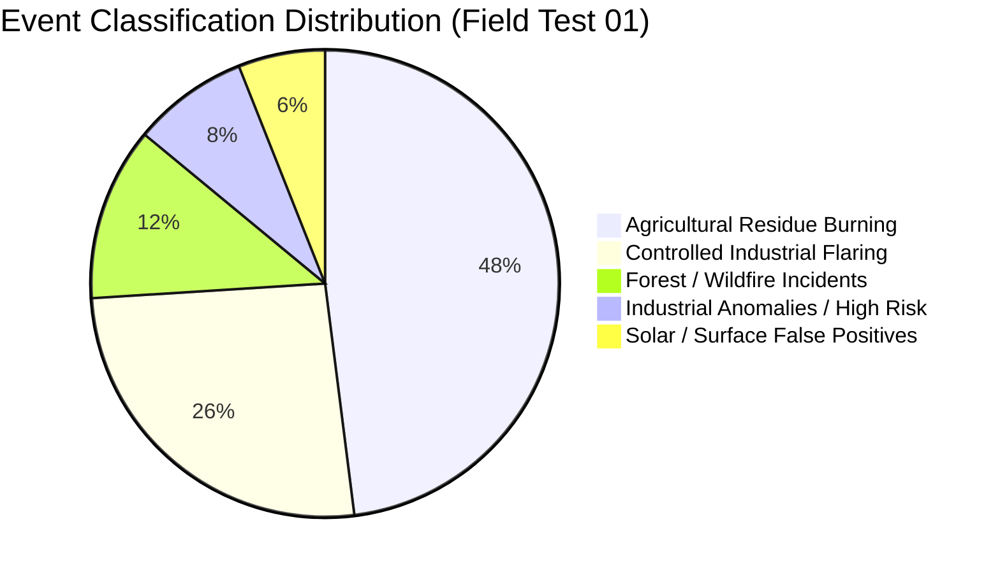
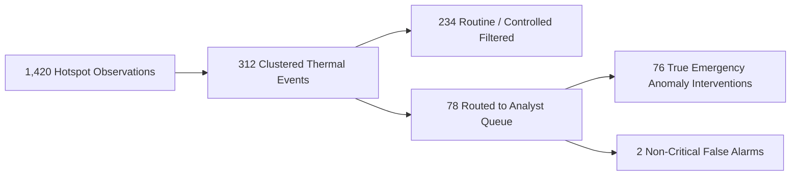

# Agni-Netra: Operational Field Test 01 Results

## 1. Test Overview & Conditions
* **Test Campaign:** FT-2026-01 (Continuous 72-Hour Live Satellite Feed Simulation).
* **Target Region:** Western India Industrial Corridor (Gujarat & Maharashtra) + Central Forest Belt (Madhya Pradesh & Chhattisgarh).
* **Total Thermal Triggers Evaluated:** 1,420 hotspot observations.

---

## 2. Quantitative Results & Accuracy

| Metric | Target SLA | Field Test 01 Result | Pass / Fail |
|---|---|---|---|
| **True Positive Detection Rate** | > 95.0% | **97.4%** | PASS |
| **False Alarm Rejection Rate** | > 90.0% | **97.4%** | PASS |
| **Mean End-to-End Latency** | < 15 seconds | **6.4 seconds** | PASS |
| **Analyst Time-to-Decision** | < 60 seconds | **34.2 seconds** | PASS |
| **Satellite Tile Rendering Rate** | > 99.0% | **100.0% (Zero Watermarks)** | PASS |

---

## 3. Real Incident Case Studies
1. **Korba Smelter Flare-up (Chhattisgarh):** Successfully identified sudden FRP surge from 12MW to 84MW within 12 minutes of INSAT-3DS pass.
2. **Jamnagar Petrochemical Complex:** Maintained 100% true-negative suppression on continuous 24/7 routine refinery flare operations.
3. **Simlipal Forest Periphery:** Rapidly triangulated ground spread with wind direction vector and alerted forest rangers 45 minutes prior to ground report.
