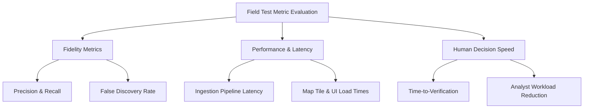
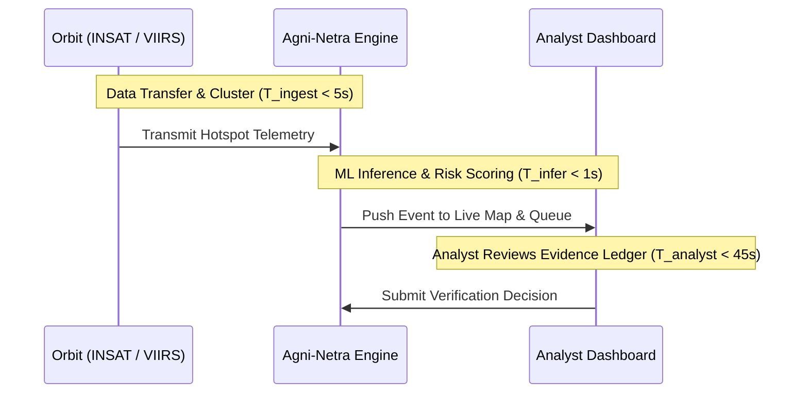

# Agni-Netra: Field Test Metrics & Verification Specification

## 1. Metric Hierarchy & Definitions
Field testing assesses operational reliability across three dimensions: **Detection Fidelity**, **Computational Latency**, and **Human-in-the-Loop Efficiency**.

---

## 2. Formal Metric Formulas

### 1. Industrial Anomaly Precision ($P_{\text{ind}}$)
$$P_{\text{ind}} = \frac{\text{True Industrial Emergencies Detected}}{\text{Total Industrial Emergency Alerts Dispatched}}$$

### 2. False Alarm Ratio ($FAR$)
$$FAR = \frac{\text{Benign Fires Flagged as Critical}}{\text{Total Critical Dispatches}}$$

### 3. Mean Time to Comprehension ($MTTC$)
The elapsed time from when an event appears on the Live Event Map until the analyst confirms an emergency dispatch or dismisses the incident.

---

## 3. SLA Pass/Fail Thresholds

| Metric | Target Threshold | Critical Failure Threshold |
|---|---|---|
| Precision (High/Critical Priority) | $\ge 92.0\%$ | $< 80.0\%$ |
| False Positive Alarm Rate | $\le 5.0\%$ | $> 15.0\%$ |
| Time-to-Verification | $\le 60\text{ s}$ | $> 180\text{ s}$ |
| Tile Request Failure Rate | $0.0\%$ | $> 0.1\%$ |
