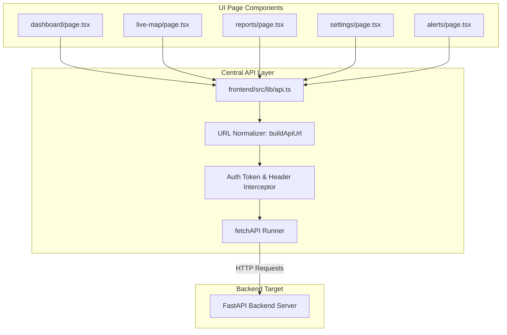
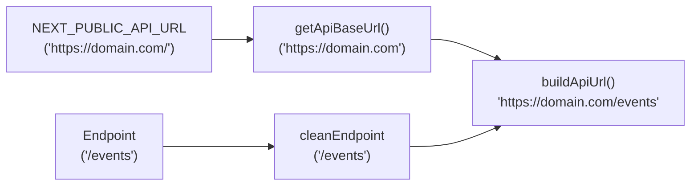

# Agni-Netra: Frontend API Client & State Management

## 1. Client Architecture
The frontend client uses a centralized API access layer in [`frontend/src/lib/api.ts`](file:///d:/Buildlaunchs/Agni-Netra/frontend/src/lib/api.ts). It enforces URL normalization, header injection, authentication token lifecycle, and error isolation across all UI pages.



---

## 2. API Method Reference

```typescript
// Core Data Fetchers
fetchDashboardSummary(): Promise<DashboardSummary>
fetchEvents(params?: FilterParams): Promise<EventItem[]>
fetchEventDetail(eventId: string): Promise<EventDetail | null>
fetchEventTimeline(eventId: string): Promise<TimelinePoint[]>
fetchSources(): Promise<DataSourceItem[]>
fetchAlerts(): Promise<AlertItem[]>
fetchModelStatus(): Promise<ModelStatus | null>

// Analyst Mutations
verifyEvent(eventId: string, payload: VerificationPayload): Promise<VerificationResult>

// Report & Document Generators
fetchReportData(eventId: string): Promise<any>
exportReportCsvBlob(): Promise<Blob>
exportReportPdfBlob(eventId: string): Promise<Blob>
```

---

## 3. URL Normalization Engine
To prevent double slashes (e.g., `https://domain.com//events`) in diverse deployment environments (Vercel, Render, Localhost), all requests pass through `buildApiUrl()`:


