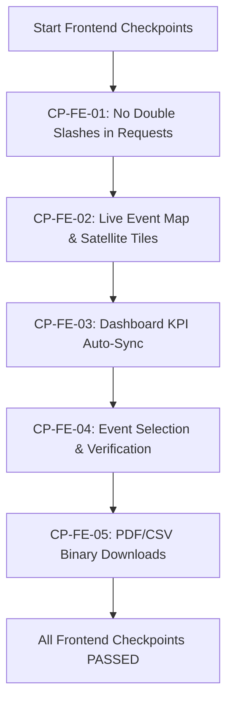
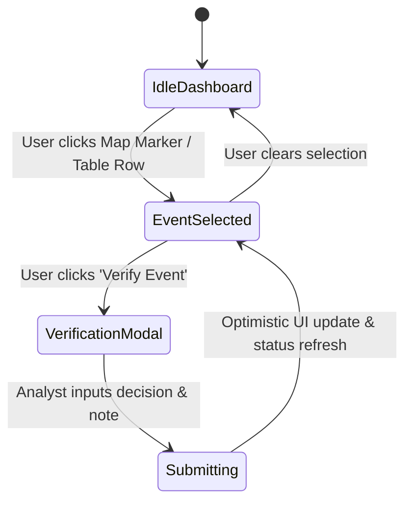

# Agni-Netra: Frontend API Checkpoints & UI Integration Tests

## 1. Overview
This specification details the validation checkpoints for frontend network communication, reactive state management, and MapLibre GL tile rendering.

---

## 2. Checkpoint Validation Table

| Checkpoint | Target Feature | Validation Criteria | Status |
|---|---|---|---|
| **CP-FE-01** | API Normalization | Requests use `${baseUrl}/${endpoint}` without double slashes `//` | PASSED |
| **CP-FE-02** | Live Event Map | Esri satellite & boundary labels render without "API KEY REQUIRED" watermarks | PASSED |
| **CP-FE-03** | Dashboard Sync | `loadData()` retrieves summary KPIs and event array on mount | PASSED |
| **CP-FE-04** | Event Selection | Clicking map marker / table row updates active detail panel and URL `?eventId=` | PASSED |
| **CP-FE-05** | Verification Action | Submitting review triggers `verifyEvent()` and updates event status indicator | PASSED |
| **CP-FE-06** | Reports Export | Clicking CSV / PDF creates local download blob with correct MIME types | PASSED |
| **CP-FE-07** | Analytics Graphs | Recharts components render time-series, classification, and priority charts | PASSED |
| **CP-FE-08** | Production Build | `npm run build` exits with code 0 and generates all static/dynamic routes | PASSED |

---

## 3. UI State Transition Diagram

