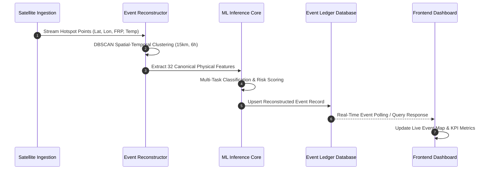

# Agni-Netra: System Architecture & Deployment Infrastructure

## 1. System Topology
Agni-Netra operates as a distributed system comprising external satellite telemetry providers, an asynchronous ingestion and AI inference engine, a persistent relational datastore, and a Next.js operational web console.

```mermaid
graph TB
    subgraph External Observation Providers
        EXT1[NASA FIRMS Near-Real-Time API]
        EXT2[ISRO MOSDAC / INSAT-3DS Feed]
        EXT3[ESA Copernicus STAC API]
        EXT4[OpenWeatherMap API]
        EXT5[OpenStreetMap Overpass API]
    end

    subgraph Agni-Netra Backend Service (Render / Cloud)
        ING[Ingestion Pipeline Worker]
        ML[AI/ML Inference Engine]
        API[FastAPI Gateway]
        DB[(SQLite / PostgreSQL DB)]
    end

    subgraph Agni-Netra Frontend Application (Vercel / Cloud)
        WEB[Next.js 14 SSR / Static Pages]
        MAP[MapLibre GL Vector / Raster Canvas]
    end

    EXT1 & EXT2 & EXT3 & EXT4 & EXT5 --> ING
    ING --> ML
    ML --> DB
    DB <--> API
    API <--> WEB
    WEB --> MAP
```

---

## 2. Data Flow Pipeline



---

## 3. Network & Security Architecture
* **Frontend Hosting:** Deployed on edge infrastructure (Vercel) communicating over HTTPS.
* **Backend Hosting:** Deployed on Render container runtime with automatic health monitoring (`/health`).
* **Tile Caching:** Esri World Imagery & World Boundaries tiles served via global high-speed CDN without client token restrictions.
* **Environment Configuration:** Clean environment variable separation (`NEXT_PUBLIC_API_URL` on frontend, `DATABASE_URL` and `SECRET_KEY` on backend).
