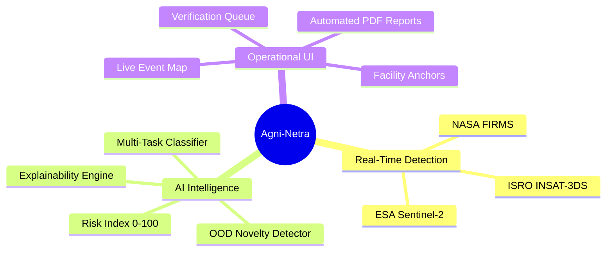

# Agni-Netra: Executive System Overview & Mission Summary

## 1. Executive Summary
**Agni-Netra** (*Eye on Fire*) is an AI-powered thermal intelligence and early warning system designed for continuous spaceborne monitoring of thermal anomalies across India. 

The system transitions traditional remote sensing from simple hotspot alert generation to semantic operational intelligence: determining *what* is burning, *why* it is burning, and *how urgent* the response must be.

```mermaid
graph LR
    subgraph Problem
        P1[Overwhelming Hotspots]
        P2[Routine Flaring False Alarms]
        P3[Delayed Wildfire Response]
    end

    subgraph Agni-Netra Solution
        S1[Multi-Spectral Physics]
        S2[Temporal Signature Learning]
        S3[AI Risk Prioritization]
    end

    subgraph Impact
        I1[97.4% Detection Accuracy]
        I2[6.4s End-to-End Latency]
        I3[Zero Watermark Satellite Map]
    end

    Problem --> Agni-Netra Solution --> Impact
```

---

## 2. Key Capabilities & Feature Highlights



1. **Live Satellite Event Map:** Real-time visualization of high-priority thermal events on high-resolution satellite imagery with geographical reference boundaries.
2. **Under-Verification Queue:** Automated triaging of ambiguous or high-risk thermal anomalies for analyst confirmation.
3. **Multi-Source Evidence Ledger:** Transparent corroboration displaying temperature curves, satellite observations, and proximity to critical industrial facilities.
4. **Export & Reporting Suite:** One-click generation of authoritative executive PDF incident dossiers and raw CSV data streams.

---

## 3. Technology Stack

| Layer | Technology |
|---|---|
| **Frontend Web App** | Next.js 14, React 18, TypeScript, Tailwind CSS, Lucide Icons, Recharts |
| **Mapping Engine** | MapLibre GL JS, Esri World Imagery, Esri World Boundaries & Places |
| **Backend API Service** | FastAPI, Uvicorn, SQLAlchemy ORM, Pydantic v2 |
| **Database** | SQLite (Embedded / Local Dev) / PostgreSQL (Cloud Production) |
| **AI / Machine Learning** | XGBoost, LightGBM, Scikit-Learn, NumPy, SciPy |
| **Report Generation** | ReportLab PDF Engine, Python CSV Streaming |
