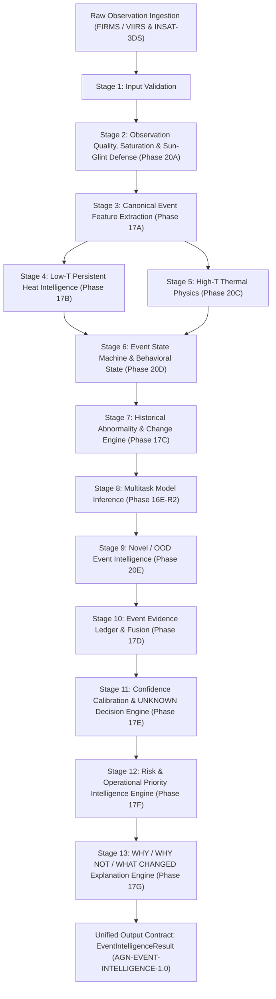

# Agni-Netra AI/ML Final Architecture Master Document (Frozen MVP)

> [!IMPORTANT]
> **Source of Truth for Agni-Netra AI/ML Intelligence Stack**
> - **Schema Version**: `AGN-EVENT-INTELLIGENCE-1.0`
> - **Pipeline Version**: `1.0.0`
> - **Model Weights**: `src/model/multitask_b0_weights.pth` (FROZEN / IMMUTABLE)
> - **Ground-Truth Disclaimer**: `REAL OBSERVATION != REAL GROUND TRUTH`. Detections represent satellite observations. Real-world ground truth gold standard (`REAL_GOLD`) is not established.

---

## 1. Problem Framing & Core Principles

Agni-Netra is a production-grade AI/ML intelligence system designed to detect, characterize, assess, and explain industrial fires, flares, and thermal events across India and South Asia using spaceborne satellite remote sensing observations (FIRMS / VIIRS and INSAT-3DS).

The system addresses critical challenges in industrial thermal monitoring:
1. **Preventing Forced Classification**: Industrial environments contain novel, poorly represented, or mixed-source thermal phenomena. Agni-Netra explicitly separates known-class prediction from out-of-distribution (OOD) novelty detection to avoid forcing novel events into incorrect source categories.
2. **Safe Abstention & Uncertainty Gating**: Missing observations, cloud cover, sensor saturation, daytime solar glint, or contradictory evidence trigger explicit `UNKNOWN`, `NEEDS_VERIFICATION`, or `INSUFFICIENT_OBSERVATION` states rather than false high-confidence classifications.
3. **Decoupled Operational Intelligence**: Thermal physics, behavioral states, historical abnormality, classification confidence, physical risk, and operational priority remain strictly decoupled semantic dimensions.

---

## 2. Final Consolidated AI/ML Architecture

---

## 3. Module Map & Pipeline Responsibilities

| Stage | Module Name | Phase | Key Responsibilities & Outputs |
| :---: | :--- | :---: | :--- |
| **1** | `analyze_event._validate_event_input` | Phase 18 | Validates latitude, longitude, observation counts, and basic structure. |
| **2** | `src/intelligence/observation_quality.py` | Phase 20A | Detects thermal saturation, pixel-folding risk, daytime solar glint contamination, and downweights low-quality observations. |
| **3** | `src/features/canonical_event_features.py` | Phase 17A | Extracts 35+ online-safe thermal, temporal, spatial, context, and historical features (`CanonicalEventFeatures`). |
| **4** | `src/features/low_t_persistent_heat.py` | Phase 17B | Evaluates low-temperature, persistent industrial heat signatures (`LowTResult`). |
| **5** | `src/intelligence/high_t_thermal.py` | Phase 20C | Evaluates high-temperature thermal physics, brightness temperature (T4/T11), and thermal intensity (`HighTThermalAssessment`). |
| **6** | `src/intelligence/event_state_machine.py` | Phase 20D | Manages behavioral state transitions (`NEW`, `PERSISTING`, `STABLE`, `INTERMITTENT`, `ESCALATING`, `ABNORMAL`, `RESOLVING`, `DORMANT`, `REACTIVATED`, `UNKNOWN`). |
| **7** | `src/intelligence/historical_abnormality.py` | Phase 17C | Evaluates baseline abnormality, FRP change points, and historical recurrence (`AbnormalityResult`). |
| **8** | `src/model/multitask_b0.py` | Phase 16E-R2 | Computes raw source-class probabilities across 9 canonical classes using frozen EfficientNet-B0 backbone. |
| **9** | `src/intelligence/novel_event_detection.py` | Phase 20E | Evaluates 6 OOD signals, computes `novelty_score` and `distribution_state` (`KNOWN_LIKE`, `NOVEL`, `UNKNOWN`), handles model-confidence paradox. |
| **10** | `src/intelligence/evidence_aggregation.py` | Phase 17D | Aggregates structured evidence items into `EventEvidenceLedger`, evaluating completeness and convergence. |
| **11** | `src/intelligence/confidence_decision.py` | Phase 17E | Applies confidence calibration, contradiction penalties, and safe abstention gates (`KNOWN`, `UNKNOWN`, `NEEDS_VERIFICATION`, `INSUFFICIENT_OBSERVATION`). |
| **12** | `src/intelligence/risk_priority.py` | Phase 17F | Evaluates physical hazard score, contextual facility impact, base risk, operational urgency, and priority levels (`P0` to `P4`). |
| **13** | `src/intelligence/explanation_engine.py` | Phase 17G | Generates evidence-grounded `summary`, `why`, `why_not`, `what_changed`, `uncertainty`, and `next_action` explanations. |
| **Orchestration** | `src/intelligence/analyze_event.py` | Phase 18 | Unified single entry point executing Stages 1–13 deterministically. |
| **Contract** | `src/intelligence/output_contract.py` | Phase 20G | Formats and validates the 16-section frozen output contract (`AGN-EVENT-INTELLIGENCE-1.0`). |
| **Replay & Demo** | `src/intelligence/real_event_replay.py` `src/intelligence/demo_scenarios.py` | Phase 20F Phase 20H | Replays real FIRMS/VIIRS events and extracts deterministic behavioral scenarios (`AI_BEHAVIOR_SCENARIO_MATRIX`). |

---

## 4. Frozen Canonical Vocabularies

All AI intelligence modules enforce centralized frozen vocabularies:

- **`SOURCE_CLASSES`**: `INDUSTRIAL_FIRE`, `ROUTINE_FLARE`, `ABNORMAL_EMERGENCY_FLARE`, `WILDFIRE`, `AGRICULTURAL_BURN`, `MINING_INDUSTRIAL_HEAT`, `LANDFILL_OTHER_ANTHROPOGENIC`, `OTHER`, `UNKNOWN`
- **`DECISION_STATES`**: `KNOWN`, `UNKNOWN`, `NEEDS_VERIFICATION`, `INSUFFICIENT_OBSERVATION`
- **`DISTRIBUTION_STATES`**: `KNOWN_LIKE`, `NOVEL`, `UNKNOWN`
- **`EVENT_STATES`**: `NEW`, `PERSISTING`, `STABLE`, `INTERMITTENT`, `ESCALATING`, `ABNORMAL`, `RESOLVING`, `DORMANT`, `REACTIVATED`, `UNKNOWN`
- **`RISK_LEVELS`**: `VERY_LOW`, `LOW`, `MODERATE`, `HIGH`, `VERY_HIGH`, `CRITICAL`, `UNKNOWN`
- **`PRIORITY_LEVELS`**: `P0`, `P1`, `P2`, `P3`, `P4`, `P0_CRITICAL`, `P1_URGENT`, `P2_EVALUATE`, `P3_MONITOR`, `P4_ROUTINE`, `UNKNOWN`
- **`URGENCY_LEVELS`**: `LOW`, `NORMAL`, `MODERATE`, `HIGH`, `URGENT`, `CRITICAL`, `IMMEDIATE`, `UNKNOWN`
- **`VERIFICATION_STATES`**: `NOT_REQUIRED`, `VERIFY_REQUIRED`, `REVIEW_RECOMMENDED`, `INSUFFICIENT_DATA`, `HUMAN_VERIFIED`, `HUMAN_DISPUTED`, `UNKNOWN`
- **`QUALITY_LEVELS`**: `GOOD`, `ACCEPTABLE`, `DEGRADED`, `POOR`, `UNKNOWN`
- **`EVIDENCE_DIRECTIONS`**: `SUPPORTING`, `CONFLICTING`, `MISSING`, `NEUTRAL`
- **`EVIDENCE_STATUSES`**: `OBSERVED`, `DERIVED`, `UNAVAILABLE`, `NOT_APPLICABLE`

---

## 5. Mandatory Semantic Invariants

The system programmatically validates the following domain invariants across all execution paths:

1. `SOURCE != EVENT_STATE`: Source classification (`WILDFIRE`) is distinct from behavioral state (`PERSISTING`).
2. `BEHAVIOR != ABNORMALITY`: Low-T persistence or temporal stability is decoupled from baseline abnormality.
3. `ABNORMALITY != NOVELTY`: Historical baseline shifts do not automatically imply out-of-distribution archetype novelty.
4. `NOVELTY != DECISION_STATE`: Distribution state (`NOVEL`) is separate from decision state (`NEEDS_VERIFICATION`).
5. `OBSERVATION_QUALITY != CLASSIFICATION`: Saturated or glint-contaminated observations downweight evidence, not force specific fire classes.
6. `MODEL_CONFIDENCE != DECISION_CONFIDENCE`: Raw model output probabilities are distinct from overall decision confidence.
7. `CONFIDENCE != RISK`: Low decision confidence does not imply low physical risk.
8. `RISK != PRIORITY`: Priority scales with operational urgency and context impact, not raw physical hazard alone.
9. `LOW-T != SOURCE` & `HIGH-T != SOURCE`: Thermal intensity physics does not dictate source classification directly.
10. `INSAT-3DS != GROUND_TRUTH`: High-cadence GEO thermal observations provide temporal continuity but do not represent gold-standard ground truth.
11. `MISSING_EVIDENCE != NEGATIVE_EVIDENCE`: Absent sensor passes (INSAT, Sentinel, SAR) produce `MISSING` evidence items, never negative indicators.
12. `DORMANT != CONFIRMED_EXTINCTION`: Thermal dormancy indicates observation gaps, not confirmed physical extinction.
13. `UNKNOWN != FAILURE`: `UNKNOWN` is a valid, safe abstention outcome when evidence is insufficient or contradictory.

---

## 6. Output Contract (`AGN-EVENT-INTELLIGENCE-1.0`)

The canonical output payload (`EventIntelligenceResult`) contains 16 top-level sections:

1. **`event`**: Metadata, location, timestamps, observation count.
2. **`observation`**: Data quality summary, usable/degraded counts, sensor availability.
3. **`thermal`**: Low-T state, High-T physics mode, FRP summary, brightness temperatures (T4/T11).
4. **`behavior`**: Event state, state history, state transitions, low-T/high-T behavior signals.
5. **`abnormality`**: Abnormality score, abnormality level, change detection summary, baseline tier.
6. **`source`**: Predicted source class, decision state, model confidence, raw probabilities, class compatibility scores.
7. **`novelty`**: Novelty score, novelty level, distribution state (`NOVEL`/`KNOWN_LIKE`), novelty drivers.
8. **`evidence`**: Full evidence ledger, supporting/conflicting/missing/neutral families, completeness, convergence.
9. **`confidence`**: Classification confidence, calibration status, contradiction penalty, overall decision confidence, abstention reason codes.
10. **`risk`**: Hazard score/level, impact score/level, base risk score, risk level, risk confidence.
11. **`priority`**: Priority score/level (`P0`–`P4`), urgency, operational action, priority drivers.
12. **`explanation`**: Structured evidence-grounded `summary`, `why`, `why_not`, `what_changed`, `uncertainty`, `next_action`.
13. **`verification`**: Verification state (`VERIFY_REQUIRED`, `NOT_REQUIRED`, etc.) and human verification requirement flags.
14. **`pipeline`**: Pipeline status (`COMPLETE`, `PARTIAL`, `INSUFFICIENT_OBSERVATION`), stage statuses, execution latencies.
15. **`limitations`**: Missing data tags, unavailable sensors, quality limitations, model boundaries.
16. **`provenance`**: Source observation IDs, evidence source IDs, evidence family IDs, machine-readable reason codes.

---

## 7. Real-Data Verification & Replay Harness

- **Replay Harness (`src/intelligence/real_event_replay.py`)**: Replays real FIRMS/VIIRS observations through `analyze_event()`, performing stage-by-stage consistency audits, vocabulary validation, and SHA-256 data fingerprinting.
- **Behavioral Scenarios (`src/intelligence/demo_scenarios.py`)**: Deterministically extracts representative real-data scenarios (Persistent, Escalating, Sparse, Novel/OOD, High Priority) exported to [`docs/demo/ai_behavior_scenario_matrix.json`](file:///C:/Users/NIrmit/Desktop/Agni-Netra/Agni-Netra/docs/demo/ai_behavior_scenario_matrix.json) and [`docs/demo/ai_behavior_scenario_matrix.md`](file:///C:/Users/NIrmit/Desktop/Agni-Netra/Agni-Netra/docs/demo/ai_behavior_scenario_matrix.md).

---

## 8. Scientific Limitations & Ground-Truth Disclaimer

> [!WARNING]
> - **No Established Ground-Truth Gold Standard (`REAL_GOLD`)**: The current system operates on spaceborne remote sensing observations (`REAL_OBSERVATION`). While observations are real FIRMS/VIIRS satellite detections, verified ground-truth labels for every industrial facility in India are not established.
> - **Observational Coverage Gaps**: Satellite overpass schedules (VIIRS ~12-hour revisit, INSAT-3DS GEO 15-minute cadence) create temporal observation gaps. Absence of detection during an overpass gap does not confirm physical extinction.

---

## 9. Future Research Roadmap (`FUTURE / VALIDATION-REQUIRED`)

The following advanced research directions are documented as prospective future extensions and are **NOT** part of the frozen MVP:

1. **Conformal Prediction**: Distribution-free uncertainty guarantees for source classification prediction sets.
2. **Full VNF / Planck Multispectral Inversion**: Complete multispectral Planck curve fitting when Sentinel-2 SWIR / VIIRS M-band raw radiances are integrated.
3. **AlphaEarth & SAR/NISAR Fusion**: Integration of Sentinel-1 / NISAR L-band & C-band SAR backscatter for surface change corroboration.
4. **TROPOMI & CAAQMS Atmospheric Fusion**: Co-locating satellite $\text{NO}_2 / \text{SO}_2 / \text{CO}$ plume detections and ground-based CAAQMS air quality sensor networks.
5. **Deep Evidential Fusion**: Dirichlet distribution-based evidential neural network fusion for multi-sensor uncertainty quantification.
6. **Atmospheric Plume Dispersion Modeling**: Integration of HYSPLIT / CALPUFF atmospheric dispersion modeling for ground-level smoke/flue gas transport.
