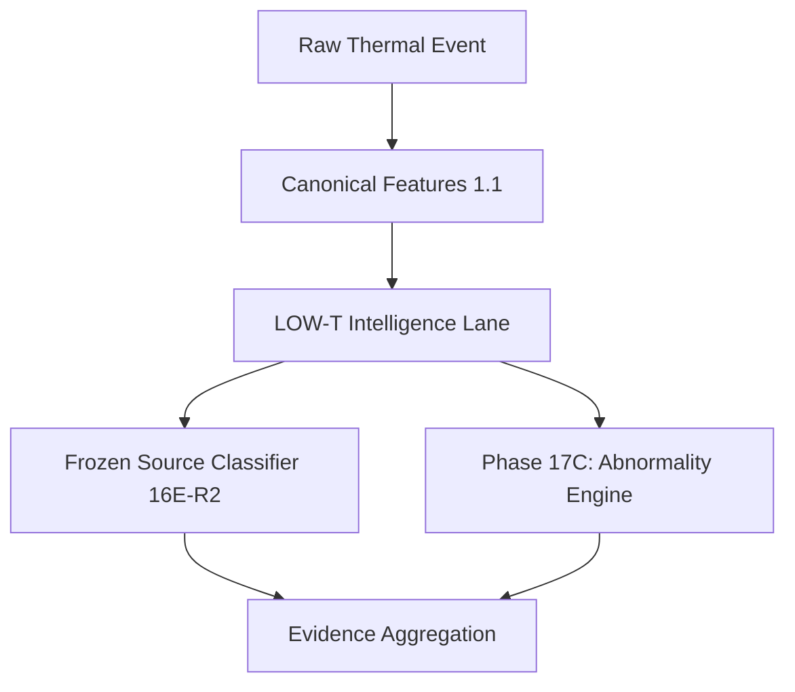

# Low-T Persistent Thermal Behavior Intelligence Lane

## 1. Purpose
The Low-T Persistent Heat Intelligence Lane addresses a crucial gap in automated satellite thermal anomaly detection: the false equivalence of "Low FRP = Low Importance." 
Industrial facilities frequently produce persistent, spatially stable, and recurrent moderate thermal signatures corresponding to routine operations, process heat, flares, or industrial malfunctions. This lane evaluates thermal events explicitly for these cross-class behavioral signatures (persistence, spatial stability, recurrence) without prematurely labeling them as a specific source class like "INDUSTRIAL_FIRE."

## 2. Cross-Class Scope
The Low-T lane is **NOT** an Industrial-Fire-only module. It operates across multiple source hypotheses:
- `INDUSTRIAL_FIRE`
- `ROUTINE_FLARE`
- `ABNORMAL_EMERGENCY_FLARE`
- `WILDFIRE`
- `AGRICULTURAL_BURN`
- `MINING_INDUSTRIAL_HEAT`
- `LANDFILL_OTHER_ANTHROPOGENIC`
- `UNKNOWN`

**Core Principle:**
`Source ≠ Behavior ≠ Abnormality`

A routine flare may exhibit `LOW_T_PERSISTENT` behavior with `NORMAL` abnormality. A developing wildfire may also exhibit `LOW_T_PERSISTENT` behavior but in a vegetation context.

## 3. Configuration & Thresholds
The lane relies on explicit MVP (Minimum Viable Product) policy configurations defined in `LowTConfig`, rather than hardcoded magic numbers:
- `MAX_FRP_FOR_LOW_T` (e.g., 150 MW) - The upper bound for "moderate" intensity.
- `MIN_OBSERVATIONS` - Minimum detections to consider.
- `MIN_PERSISTENCE_HOURS` - Required temporal span.
- `MAX_SPATIAL_DRIFT_KM` - Limit for spatial footprint drift to be considered "stable".
- `MIN_TEMPORAL_CONSISTENCY` - Minimum density of observations over the persistence window.
- `MIN_RECURRENCE` - Baseline evidence of repetitive behavior.

## 4. Score Formulation
The `LOW_T_PERSISTENT_SCORE` is an interpretable intelligence and evidence score (0.0 to 1.0), **NOT a scientifically calibrated probability or a fire likelihood**. It transparently weights:
- Persistence (duration) [30%]
- Temporal Consistency (density) [20%]
- Spatial Stability [20%]
- Historical Recurrence [20%]
- Context Support [10%]

The final score is multiplied by an **evidence completeness** factor to heavily penalize classifications made on entirely missing data.

## 5. Output States
The module maps the score to discrete decision states:
- `LOW_T_PERSISTENT`: Strong evidence of sustained, recurrent moderate activity.
- `LOW_T_POSSIBLE`: Some behavioral evidence, but weaker spatial or historical stability.
- `LOW_T_INSUFFICIENT_EVIDENCE`: Lacking enough quality data or completeness to make a persistent claim.
- `LOW_T_NOT_APPLICABLE`: Short-lived or highly intense events outside the Low-T bounds.

## 6. Missing Data Policy
Missing data is explicitly handled as *missing evidence*, not negative evidence:
- **Missing History**: Produces a lower `evidence_completeness` penalty, rather than fabricating a zero recurrence baseline.
- **Missing Optical (Sentinel)**: Reflected in missing evidence generation, without actively subtracting from the thermal behavior score.

## 7. Online Leakage Safety
This module utilizes `AGN-FEATURES-1.1` from the canonical pipeline. Retrospective fields (e.g., final event duration) are strictly forbidden in `online` inference, ensuring the Low-T intelligence lane evaluates events safely as they develop in real-time.

## 8. Integration Architecture

