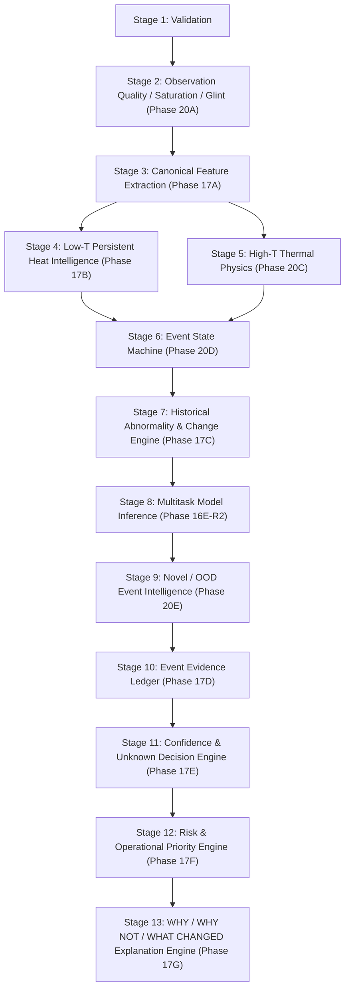

# Phase 20F — AI Pipeline Consolidation & Real-Data Readiness

## Executive Summary

Phase 20F consolidates the complete **Agni-Netra** AI/ML intelligence stack (Phases 17A–G, Phase 18, and Phases 20A–E) and verifies its coherent, deterministic, and reproducible operation on **REAL FIRMS/VIIRS thermal observations**.

> [!IMPORTANT]
> **Core Operational Guarantees:**
> - `REAL OBSERVATION != REAL GROUND TRUTH`
> - `PIPELINE READINESS != CLASSIFICATION ACCURACY`
> - `UNKNOWN IS A VALID OUTCOME`
> - `MISSING SENSOR DATA IS NOT NEGATIVE EVIDENCE`

This phase is **NOT** a model-retraining or accuracy-optimization campaign. It establishes that all 13 AI intelligence stages execute harmoniously on real satellite observation data with zero schema drift, full provenance preservation, frozen vocabularies, and explicit semantic invariant enforcement.

---

## 1. Complete Consolidated AI Pipeline Architecture

Every real reconstructed thermal event moves deterministically through the 13 unified stages of `analyze_event()`:

---

## 2. Frozen Canonical Vocabularies

To prevent schema drift and uncoordinated terminology, all outputs adhere to frozen canonical vocabularies:

### A. Source Classes (`SOURCE_CLASSES`)
- `INDUSTRIAL_FIRE`
- `ROUTINE_FLARE`
- `ABNORMAL_EMERGENCY_FLARE`
- `WILDFIRE`
- `AGRICULTURAL_BURN`
- `MINING_INDUSTRIAL_HEAT`
- `LANDFILL_OTHER_ANTHROPOGENIC`
- `OTHER`
- `UNKNOWN`

### B. Decision States (`DECISION_STATES`)
- `KNOWN`
- `UNKNOWN`
- `NEEDS_VERIFICATION`
- `INSUFFICIENT_OBSERVATION`

### C. Distribution States (`DISTRIBUTION_STATES`)
- `KNOWN_LIKE`
- `NOVEL`
- `UNKNOWN`

### D. Behavioral Event States (`EVENT_STATES`)
- `NEW`
- `PERSISTING`
- `STABLE`
- `INTERMITTENT`
- `ESCALATING`
- `ABNORMAL`
- `RESOLVING`
- `DORMANT`
- `REACTIVATED`
- `UNKNOWN`

---

## 3. Mandatory Semantic Invariants

The `StageConsistencyAuditor` programmatically enforces the following core domain invariants during every real-data replay run:

1. `SOURCE != BEHAVIOR`: Source identity is distinct from temporal behavior.
2. `SOURCE != EVENT_STATE`: Source classification is separate from state machine transitions (`NEW`, `PERSISTING`, etc.).
3. `BEHAVIOR != ABNORMALITY`: Low-T persistence or temporal stability is decoupled from baseline abnormality.
4. `ABNORMALITY != NOVELTY`: Historical baseline shifts do not automatically imply out-of-distribution archetype novelty.
5. `NOVELTY != UNKNOWN`: An event can be `NOVEL` with high model confidence or `UNKNOWN` due to data sparsity.
6. `OBSERVATION_QUALITY != CLASSIFICATION`: Saturated or glint-contaminated observations downweight evidence, not force specific fire classes.
7. `MODEL_CONFIDENCE != DECISION_CONFIDENCE`: Raw model output probabilities are gated by evidence completeness, sensor quality, and novelty assessments.
8. `CONFIDENCE != RISK` & `RISK != PRIORITY`: Operational priority scales with context impact and verification urgency, not raw confidence or hazard alone.
9. `MISSING_EVIDENCE != NEGATIVE_EVIDENCE`: Absent sensor passes (INSAT, Sentinel, SAR) produce `MISSING` evidence items, never negative indicators.
10. `DORMANT != CONFIRMED_EXTINCTION`: Thermal dormancy indicates observation gaps, not confirmed physical extinction.
11. `HIGH-T != INDUSTRIAL_FIRE` & `LOW-T != INDUSTRIAL_FIRE`: Thermal intensity physics does not dictate source classification directly.
12. `INSAT-3DS != GROUND_TRUTH`: GEO thermal observations strengthen temporal continuity but do not serve as absolute gold labels.

---

## 4. Real Data Replay Harness (`RealDataReplayHarness`)

The AI-side real-data replay harness (`src/intelligence/real_event_replay.py`):
- Loads real FIRMS/VIIRS observations from `data/interim/events/events.csv` and `event_observations.csv`.
- Reconstructs event identity (`event_id`, `source_sensor`, `observation_ids`, `first_observation`, `last_observation`, `centroid`, `observation_count`).
- Executes `analyze_event()` across the 13 pipeline stages.
- Performs `audit_stage_consistency()` checking schema drift, vocabulary compliance, semantic invariants, and provenance.
- Generates a deterministic `REAL_DATA_PIPELINE_READINESS` snapshot report.
- Computes SHA-256 data fingerprints (`fingerprint_hash`) for input reproducibility.

---

## 5. Failure Matrix Test Coverage

The replay harness validates the AI pipeline against 12 deterministic real & degraded observation conditions (Cases A through L):

| Case | Scenario | Expected Behavior |
| :--- | :--- | :--- |
| **A** | Complete Real Event | Full 13-stage execution, complete evidence ledger, high confidence |
| **B** | Sparse Real Event | `INSUFFICIENT_OBSERVATION` or `UNKNOWN` state triggered safely |
| **C** | Missing History | `missing_history` limitation set, abnormality gracefully falls back |
| **D** | INSAT Absent | `INSAT-3DS` marked unavailable in limitations, missing evidence registered |
| **E** | Sentinel Absent | `SENTINEL` marked unavailable, pipeline operates on VIIRS only |
| **F** | SAR Absent | `SAR` marked unavailable, no fake radar evidence manufactured |
| **G** | Degraded Quality | Evidence downweighted, observation quality limitations propagated |
| **H** | Saturation Risk | `SATURATION_LIKELY` flag raised, thermal physics lane qualified |
| **I** | Solar Glint Risk | Daytime glint warning logged, evidence downweighted safely |
| **J** | Uncertain Source | Ambiguity reflected in class probabilities, `NEEDS_VERIFICATION` |
| **K** | Novel / OOD | `distribution_state = NOVEL` triggered, model-confidence paradox handled |
| **L** | Multi-Obs Persistent | `event_state = PERSISTING` assigned, Low-T persistent heat lane active |

---

## 6. What This Phase Does NOT Prove

1. **Model Classification Accuracy**: Replay readiness verifies software & schema execution integrity on real observations, not overall statistical F1/accuracy against gold labels.
2. **Ground Truth Validation**: Real satellite detections represent observations, not verified ground-truth labels.
3. **External Systems Integration**: Backend databases, REST APIs, web GIS interfaces, and alerting infrastructure are intentionally excluded from this AI capability freeze.

---

## 7. Model Integrity Check

- **Frozen Weights Asset**: `src/model/multitask_b0_weights.pth`
- **Hash Integrity**: Verified unchanged via SHA-256 digest validation.
- **Architectural Constraints**: Zero alterations to Phase 16E-R2 architecture, preprocessing assumptions, or calibrated thresholds.
